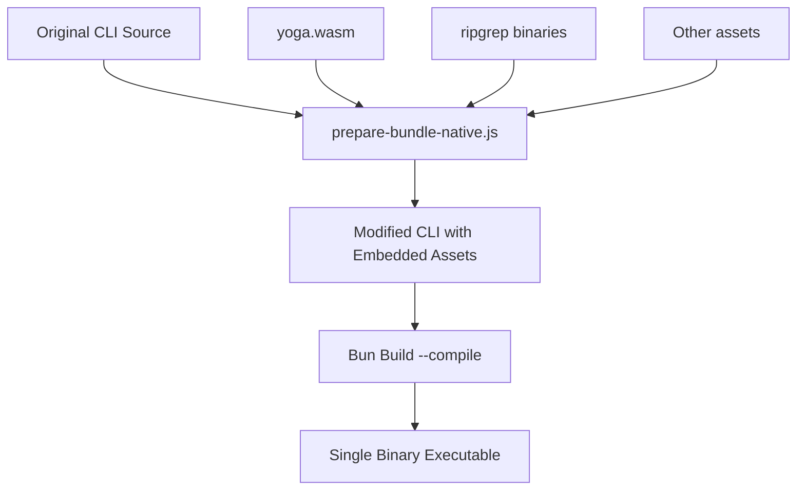

# Claude Code Single-Binary Executables

This document provides comprehensive information about building Claude Code as single-binary executables for multiple platforms using Bun's native compilation and embedding features.

## Table of Contents

- [Overview](#overview)
- [Technical Architecture](#technical-architecture)
- [Build Prerequisites](#build-prerequisites)
- [Building Executables](#building-executables)
- [Distribution Matrix](#distribution-matrix)
- [Platform-Specific Notes](#platform-specific-notes)
- [Troubleshooting](#troubleshooting)
- [Technical Details](#technical-details)

## Overview

Claude Code can be compiled into standalone executables that bundle the entire application, runtime, and all assets into a single binary file. This eliminates the need for users to install Node.js, Bun, or any dependencies.

The source package is fetched from the official npm registry: [`@anthropic-ai/claude-code`](https://www.npmjs.com/package/@anthropic-ai/claude-code)

### Key Features

- **Zero Dependencies**: Single executable file with no external requirements
- **Cross-Platform**: Build for Linux, macOS, and Windows from any platform
- **Optimized**: Includes minification, sourcemaps, and optional bytecode compilation
- **Embedded Assets**: All resources (WASM files, native modules) are embedded directly
- **Multiple Variants**: Support for modern CPUs, older hardware, and different libc implementations

## Technical Architecture

### Build Process Overview



### Embedding Strategy

The build process uses Bun's native file embedding feature (`import ... with { type: "file" }`):

1. **Asset Discovery**: Identifies all external files (yoga.wasm, ripgrep binaries)
2. **Import Injection**: Adds import statements for each asset at the top of the CLI
3. **Path Patching**: Modifies file loading code to use embedded assets instead of filesystem
4. **Compilation**: Bun bundles everything into a single executable

## Build Prerequisites

### Required Software

- **Bun** v1.2.0 or later
- **Git** (for cloning the repository) or **npm** (for downloading the package)
- **Disk Space**: ~5GB for building all targets

### Getting the Source Code

Claude Code is published on npm as [`@anthropic-ai/claude-code`](https://www.npmjs.com/package/@anthropic-ai/claude-code). To download and extract it locally:

```bash
# Download the tarball from npm
npm pack @anthropic-ai/claude-code

# Extract it
tar -xzf anthropic-ai-claude-code-*.tgz

# The sources will be in the 'package' directory
cd package
```

### Installation

```bash
# Install Bun (if not already installed)
curl -fsSL https://bun.sh/install | bash

# Install dependencies (if any)
bun install
```

## Building Executables

### Quick Start

```bash
# Build for current platform only
bun run build-executables.js current

# Build all platforms
bun run build-executables.js all

# Build specific platform family
bun run build-executables.js linux    # All Linux variants
bun run build-executables.js macos    # All macOS variants
bun run build-executables.js windows  # All Windows variants
```

### Build Scripts

#### `prepare-bundle-native.js`
Prepares the CLI source for bundling by:
- Embedding yoga.wasm as base64 or native import
- Adding embedded file mappings for ripgrep binaries
- Modifying file loading paths to use embedded resources

#### `build-executables.js`
Main build orchestrator that:
- Runs the preparation script
- Executes Bun build with appropriate flags
- Handles multiple targets sequentially
- Cleans up temporary files

### Build Flags

All executables are built with these optimizations:

| Flag | Purpose | Impact |
|------|---------|--------|
| `--compile` | Create standalone executable | Bundles Bun runtime |
| `--minify` | Minimize code size | Reduces file size by ~30% |
| `--sourcemap` | Embed source maps | Enables debugging with original source |
| `--bytecode` | Precompile to bytecode | Faster startup (experimental) |

## Distribution Matrix

### Complete Build Output

| File Name | Platform | Architecture | CPU Requirements | C Library | Size | Notes |
|-----------|----------|--------------|------------------|-----------|------|-------|
| **Linux - Standard (glibc)** |
| `claude-code-linux-x64` | Linux | x64 | Any x64 CPU | glibc | 266MB | Default Linux build |
| `claude-code-linux-x64-modern` | Linux | x64 | AVX2 (2013+) | glibc | 266MB | Optimized for modern CPUs |
| `claude-code-linux-x64-baseline` | Linux | x64 | SSE2 (2003+) | glibc | 265MB | Compatible with older CPUs |
| `claude-code-linux-arm64` | Linux | ARM64 | ARMv8 | glibc | 259MB | For ARM servers, Raspberry Pi 4+ |
| **Linux - Alpine (musl)** |
| `claude-code-linux-x64-musl` | Linux | x64 | Any x64 CPU | musl | 245MB | For Alpine Linux |
| `claude-code-linux-x64-musl-modern` | Linux | x64 | AVX2 (2013+) | musl | 245MB | Alpine + modern CPU |
| `claude-code-linux-x64-musl-baseline` | Linux | x64 | SSE2 (2003+) | musl | 245MB | Alpine + older CPU |
| `claude-code-linux-arm64-musl` | Linux | ARM64 | ARMv8 | musl | 240MB | Alpine on ARM |
| **macOS** |
| `claude-code-macos-x64` | macOS | x64 | Any Intel Mac | - | 228MB | Intel Macs |
| `claude-code-macos-x64-modern` | macOS | x64 | AVX2 (2013+) | - | 228MB | Newer Intel Macs |
| `claude-code-macos-x64-baseline` | macOS | x64 | SSE2 (2006+) | - | 228MB | Older Intel Macs |
| `claude-code-macos-arm64` | macOS | ARM64 | Apple Silicon | - | 224MB | M1/M2/M3 Macs |
| **Windows** |
| `claude-code-windows-x64.exe` | Windows | x64 | Any x64 CPU | - | 280MB | Standard Windows build |
| `claude-code-windows-x64-modern.exe` | Windows | x64 | AVX2 (2013+) | - | 280MB | Modern Windows PCs |
| `claude-code-windows-x64-baseline.exe` | Windows | x64 | SSE2 (2003+) | - | 280MB | Older Windows PCs |

### Choosing the Right Build

#### By Use Case

| If you need... | Choose... |
|----------------|-----------|
| Maximum compatibility | `*-baseline` variants |
| Best performance | `*-modern` variants |
| Docker/Alpine Linux | `*-musl` variants |
| Not sure | Default variants (no suffix) |

#### By Platform Detection

```bash
# Linux - Check CPU features
lscpu | grep -i avx2  # If present, use -modern

# Check libc type
ldd --version  # GNU libc = standard, musl = use -musl

# macOS - Check architecture
uname -m  # arm64 = Apple Silicon, x86_64 = Intel
```

## Platform-Specific Notes

### Linux

#### CPU Variant Selection
- **Modern**: Requires AVX2 instruction set (Intel Haswell 2013+, AMD Excavator 2015+)
- **Baseline**: Requires only SSE2 (Intel Pentium 4 2000+, AMD Athlon 64 2003+)
- **Default**: Auto-detects at runtime (safe choice)

#### libc Variants
- **glibc** (standard): Ubuntu, Debian, RHEL, Fedora, most distros
- **musl**: Alpine Linux, void Linux, minimal containers

#### Troubleshooting "Illegal instruction"
```bash
# If you see "Illegal instruction" error:
# 1. Try the -baseline variant
# 2. Check CPU features:
cat /proc/cpuinfo | grep flags
```

### macOS

#### Universal Binaries
Currently, we build separate binaries for Intel and Apple Silicon. To create a universal binary:
```bash
# Combine Intel and ARM64 (requires macOS)
lipo -create claude-code-macos-x64 claude-code-macos-arm64 \
     -output claude-code-macos-universal
```

#### Code Signing
Executables may need to be signed for distribution:
```bash
# Sign the executable
codesign --force --deep --sign "Developer ID Application: Your Name" claude-code-macos-arm64

# Verify signature
codesign -vvv --verify claude-code-macos-arm64
```

### Windows

#### Security Warnings
Windows may show security warnings for unsigned executables. Users can:
1. Click "More info" → "Run anyway"
2. Or sign the executable with a code signing certificate

#### Windows Defender
Some antivirus software may flag the executable. This is common for:
- Packed/bundled executables
- Unsigned binaries
- Files downloaded from the internet

## Troubleshooting

### Common Issues

| Issue | Solution |
|-------|----------|
| "Cannot find module './yoga.wasm'" | Embedded assets failed to load. Rebuild with latest scripts |
| "Illegal instruction" | Use `-baseline` variant for older CPUs |
| "GLIBC_2.XX not found" | Use `-musl` variant or build on older system |
| Large file size | Normal - includes full runtime and embedded assets |
| Slow startup | Try building without `--bytecode` flag |

### Debug Mode

Enable debug output:
```bash
DEBUG=1 ./claude-code-linux-x64 --help
```

### Validation

Verify executable integrity:
```bash
# Check file type
file claude-code-linux-x64

# Check dependencies (should be minimal)
ldd claude-code-linux-x64  # Linux
otool -L claude-code-macos-arm64  # macOS

# Test basic functionality
./claude-code-linux-x64 --version
./claude-code-linux-x64 --print "Hello"
```

## Technical Details

### Embedded Assets

The following assets are embedded directly into each executable:

| Asset | Purpose | Size |
|-------|---------|------|
| `yoga.wasm` | Layout engine for terminal UI | 87KB |
| `ripgrep` binaries | Fast file searching | ~2MB per platform |
| `vsix` extension | VS Code integration | Variable |

### File Loading Patches

The build process modifies these loading mechanisms:

1. **WebAssembly Loading**
   ```javascript
   // Original
   await readFile("./yoga.wasm")
   
   // Modified
   await Bun.file(__embeddedYogaWasm).arrayBuffer()
   ```

2. **Native Module Loading**
   ```javascript
   // Original
   require("./vendor/ripgrep/x64-linux/ripgrep.node")
   
   // Modified
   require(__embeddedFiles["vendor/ripgrep/x64-linux/ripgrep.node"])
   ```

### Build Performance

Typical build times on Apple M1:
- Single target: 15-30 seconds
- All targets: 2-5 minutes
- With bytecode: +20% build time

### Security Considerations

1. **Supply Chain**: All embedded binaries are from verified sources
2. **Reproducible Builds**: Build process is deterministic
3. **No Runtime Downloads**: Everything is self-contained
4. **Code Signing**: Binaries can be signed post-build

## Contributing

### Adding New Platforms

To add support for new platforms:

1. Check Bun's supported targets: `bun build --compile --help`
2. Add target configuration to `PLATFORMS` in `build-executables.js`
3. Test the build thoroughly
4. Update this documentation

### Improving Build Process

Current areas for optimization:
- Reduce binary size (currently 200-300MB)
- Implement proper bytecode compilation when stable
- Add automatic code signing
- Create GitHub Actions for automated builds

## License

See the main LICENSE file in the repository root.

---

*Generated executables include the Bun runtime, which is licensed under MIT.* 