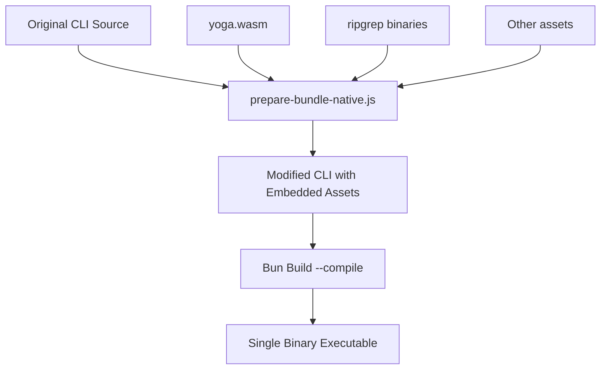

# Claude Code Single-Binary Executables

This document provides comprehensive information about building Claude Code as single-binary executables for multiple platforms using Bun's native compilation and embedding features.

## Table of Contents

- [Overview](#overview)
- [Technical Architecture](#technical-architecture)
- [Build Prerequisites](#build-prerequisites)
- [Building Executables](#building-executables)
- [Distribution Matrix](#distribution-matrix)
- [Platform-Specific Notes](#platform-specific-notes)
- [Troubleshooting](#troubleshooting)
- [Windows-Specific Fixes](#windows-specific-fixes)
  - [Import.meta Module Error Fix](#import.meta-module-error-fix)
  - [POSIX Shell Bypass](#posix-shell-bypass)
  - [Ripgrep Windows Fixes](#ripgrep-windows-fixes)
  - [Windows ARM64 Support](#windows-arm64-support)
- [Technical Details](#technical-details)
- [Contributing](#contributing)
- [License](#license)

## Overview

Claude Code can be compiled into standalone executables that bundle the entire application, runtime, and all assets into a single binary file. This eliminates the need for users to install Node.js, Bun, or any dependencies.

The source package is fetched from the official npm registry: [`@anthropic-ai/claude-code`](https://www.npmjs.com/package/@anthropic-ai/claude-code)

### Key Features

- **Zero Dependencies**: Single executable file with no external requirements
- **Cross-Platform**: Build for Linux, macOS, and Windows from any platform
- **Optimized**: Includes minification, sourcemaps, and optional bytecode compilation
- **Embedded Assets**: All resources (WASM files, native modules) are embedded directly
- **Multiple Variants**: Support for modern CPUs, older hardware, and different libc implementations

## Technical Architecture

### Build Process Overview



### Embedding Strategy

The build process uses Bun's native file embedding feature (`import ... with { type: "file" }`):

1. **Asset Discovery**: Identifies all external files (yoga.wasm, ripgrep binaries)
2. **Import Injection**: Adds import statements for each asset at the top of the CLI
3. **Path Patching**: Modifies file loading code to use embedded assets instead of filesystem
4. **Compilation**: Bun bundles everything into a single executable

## Build Prerequisites

### Required Software

- **Bun** v1.2.0 or later
- **Git** (for cloning the repository) or **npm** (for downloading the package)
- **Disk Space**: ~5GB for building all targets

### Getting the Source Code

Claude Code is published on npm as [`@anthropic-ai/claude-code`](https://www.npmjs.com/package/@anthropic-ai/claude-code). To download and extract it locally:

```bash
# Download the tarball from npm
npm pack @anthropic-ai/claude-code

# Extract it
tar -xzf anthropic-ai-claude-code-*.tgz

# The sources will be in the 'package' directory
cd package
```

### Installation

```bash
# Install Bun (if not already installed)
curl -fsSL https://bun.sh/install | bash

# Install dependencies (if any)
bun install
```

## Building Executables

### Quick Start

```bash
# Build for current platform only
bun run scripts/build/build-executables.js current

# Build all platforms
bun run scripts/build/build-executables.js all

# Build specific platform family
bun run scripts/build/build-executables.js linux    # All Linux variants
bun run scripts/build/build-executables.js macos    # All macOS variants
bun run scripts/build/build-executables.js windows  # All Windows variants
```

### Build Scripts

#### `scripts/build/prepare-bundle-native.js`
Prepares the CLI source for bundling by:
- Embedding yoga.wasm as base64 or native import
- Adding embedded file mappings for ripgrep binaries
- Modifying file loading paths to use embedded resources

#### `scripts/build/build-executables.js`
Main build orchestrator that:
- Runs the preparation script
- Executes Bun build with appropriate flags
- Handles multiple targets sequentially
- Cleans up temporary files

### Build Flags

All executables are built with these optimizations:

| Flag | Purpose | Impact |
|------|---------|--------|
| `--compile` | Create standalone executable | Bundles Bun runtime |
| `--minify` | Minimize code size | Reduces file size by ~30% |
| `--sourcemap` | Embed source maps | Enables debugging with original source |
| `--bytecode` | Precompile to bytecode | Faster startup (experimental) |

## Distribution Matrix

### Complete Build Output

| File Name | Platform | Architecture | CPU Requirements | C Library | Size | Notes |
|-----------|----------|--------------|------------------|-----------|------|-------|
| **Linux - Standard (glibc)** |
| `claude-code-linux-x64` | Linux | x64 | Any x64 CPU | glibc | 266MB | Default Linux build |
| `claude-code-linux-x64-modern` | Linux | x64 | AVX2 (2013+) | glibc | 266MB | Optimized for modern CPUs |
| `claude-code-linux-x64-baseline` | Linux | x64 | SSE2 (2003+) | glibc | 265MB | Compatible with older CPUs |
| `claude-code-linux-arm64` | Linux | ARM64 | ARMv8 | glibc | 259MB | For ARM servers, Raspberry Pi 4+ |
| **Linux - Alpine (musl)** |
| `claude-code-linux-x64-musl` | Linux | x64 | Any x64 CPU | musl | 245MB | For Alpine Linux |
| `claude-code-linux-x64-musl-modern` | Linux | x64 | AVX2 (2013+) | musl | 245MB | Alpine + modern CPU |
| `claude-code-linux-x64-musl-baseline` | Linux | x64 | SSE2 (2003+) | musl | 245MB | Alpine + older CPU |
| `claude-code-linux-arm64-musl` | Linux | ARM64 | ARMv8 | musl | 240MB | Alpine on ARM |
| **macOS** |
| `claude-code-macos-x64` | macOS | x64 | Any Intel Mac | - | 228MB | Intel Macs |
| `claude-code-macos-x64-modern` | macOS | x64 | AVX2 (2013+) | - | 228MB | Newer Intel Macs |
| `claude-code-macos-x64-baseline` | macOS | x64 | SSE2 (2006+) | - | 228MB | Older Intel Macs |
| `claude-code-macos-arm64` | macOS | ARM64 | Apple Silicon | - | 224MB | M1/M2/M3 Macs |
| **Windows** |
| `claude-code-windows-x64.exe` | Windows | x64 | Any x64 CPU | - | 280MB | Standard Windows build |
| `claude-code-windows-x64-modern.exe` | Windows | x64 | AVX2 (2013+) | - | 280MB | Modern Windows PCs |
| `claude-code-windows-x64-baseline.exe` | Windows | x64 | SSE2 (2003+) | - | 280MB | Older Windows PCs |

### Choosing the Right Build

#### By Use Case

| If you need... | Choose... |
|----------------|-----------|
| Maximum compatibility | `*-baseline` variants |
| Best performance | `*-modern` variants |
| Docker/Alpine Linux | `*-musl` variants |
| Not sure | Default variants (no suffix) |

#### By Platform Detection

```bash
# Linux - Check CPU features
lscpu | grep -i avx2  # If present, use -modern

# Check libc type
ldd --version  # GNU libc = standard, musl = use -musl

# macOS - Check architecture
uname -m  # arm64 = Apple Silicon, x86_64 = Intel
```

## Platform-Specific Notes

### Linux

#### CPU Variant Selection
- **Modern**: Requires AVX2 instruction set (Intel Haswell 2013+, AMD Excavator 2015+)
- **Baseline**: Requires only SSE2 (Intel Pentium 4 2000+, AMD Athlon 64 2003+)
- **Default**: Auto-detects at runtime (safe choice)

#### libc Variants
- **glibc** (standard): Ubuntu, Debian, RHEL, Fedora, most distros
- **musl**: Alpine Linux, void Linux, minimal containers

#### Troubleshooting "Illegal instruction"
```bash
# If you see "Illegal instruction" error:
# 1. Try the -baseline variant
# 2. Check CPU features:
cat /proc/cpuinfo | grep flags
```

### macOS

#### Universal Binaries
Currently, we build separate binaries for Intel and Apple Silicon. To create a universal binary:
```bash
# Combine Intel and ARM64 (requires macOS)
lipo -create claude-code-macos-x64 claude-code-macos-arm64 \
     -output claude-code-macos-universal
```

#### Code Signing
Executables may need to be signed for distribution:
```bash
# Sign the executable
codesign --force --deep --sign "Developer ID Application: Your Name" claude-code-macos-arm64

# Verify signature
codesign -vvv --verify claude-code-macos-arm64
```

### Windows

#### Security Warnings
Windows may show security warnings for unsigned executables. Users can:
1. Click "More info" → "Run anyway"
2. Or sign the executable with a code signing certificate

#### Windows Defender
Some antivirus software may flag the executable. This is common for:
- Packed/bundled executables
- Unsigned binaries
- Files downloaded from the internet

## Troubleshooting

### Common Issues

| Issue | Solution |
|-------|----------|
| "Cannot find module './yoga.wasm'" | Embedded assets failed to load. Rebuild with latest scripts |
| "Illegal instruction" | Use `-baseline` variant for older CPUs |
| "GLIBC_2.XX not found" | Use `-musl` variant or build on older system |
| Large file size | Normal - includes full runtime and embedded assets |
| Slow startup | Try building without `--bytecode` flag |

### Debug Mode

Enable debug output:
```bash
DEBUG=1 ./claude-code-linux-x64 --help
```

### Validation

Verify executable integrity:
```bash
# Check file type
file claude-code-linux-x64

# Check dependencies (should be minimal)
ldd claude-code-linux-x64  # Linux
otool -L claude-code-macos-arm64  # macOS

# Test basic functionality
./claude-code-linux-x64 --version
./claude-code-linux-x64 --print "Hello"
```

## Windows-Specific Fixes

### Import.meta Module Error Fix

#### Problem Solved

Windows executables were failing with the error:
```
SyntaxError: import.meta is only valid inside modules.
```

And later, after initial fixes:
```
TypeError: File URL path must be an absolute path
```

This occurred because Bun wraps ES module code in a CommonJS-style function when compiling Windows executables:
```javascript
(function(exports, require, module, __filename, __dirname) { 
    // ... ES module code here
})
```

Since `import.meta` is an ES module feature that's not valid inside CommonJS contexts, and the codebase uses `import.meta.url` in multiple places, Windows builds would fail immediately.

#### Solution Implemented

A Windows-specific build preparation script (`scripts/build/prepare-windows-bundle.js`) was created that applies a **two-layer patching approach**:

##### Layer 1: Native Bundle Preparations (Applied First)
- Embeds yoga.wasm file using Bun's native file embedding
- Embeds ripgrep binaries for all platforms
- Handles ripgrep path resolution for embedded files
- Bypasses POSIX shell requirement
- Sets up all embedded file handling

##### Layer 2: Windows-Specific import.meta Fixes (Applied on Top)

1. **Ensures absolute paths for file URLs** to prevent "File URL path must be an absolute path" errors:
   ```javascript
   // Ensure we have an absolute path for __filename
   let __executablePath;
   if (process.argv[1]) {
     const path = require('path');
     __executablePath = path.isAbsolute(process.argv[1]) ? process.argv[1] : path.resolve(process.argv[1]);
   } else {
     // Fallback to current working directory + a dummy filename
     __executablePath = require('path').join(process.cwd(), 'claude-code.exe');
   }
   ```

2. **Creates a helper function** for proper file URL generation:
   ```javascript
   function __toFileURL(path) {
     const resolved = require('path').resolve(path);
     // On Windows, we need to handle drive letters properly
     if (process.platform === 'win32') {
       // Convert backslashes to forward slashes and ensure proper format
       return 'file:///' + resolved.replace(/\\/g, '/');
     }
     return 'file://' + resolved;
   }
   ```

3. **Replaces all `import.meta.url` references** with the helper function:
   ```javascript
   // Before:
   import.meta.url
   
   // After:
   __toFileURL(__filename)
   ```

4. **Handles `fileURLToPath(import.meta.url)` patterns** simply:
   ```javascript
   // Before:
   fileURLToPath(import.meta.url)
   
   // After:
   __filename
   ```

5. **Places compatibility code at the right location** - immediately after the shebang to ensure functions are defined before use

#### Critical Insights

1. **Both patch layers are required**: Windows builds need ALL the native bundle preparations PLUS the import.meta fixes. The initial error was caused by replacing native preparations instead of building on top of them.

2. **File URL validity**: The key issue was that `process.argv[1]` in Windows executables can be:
   - A relative path (e.g., `.\claude-code.exe`)
   - Just a filename (e.g., `claude-code.exe`)
   - Undefined in some cases
   - Or even just `.`
   
   This would create invalid file URLs like `file://./claude-code.exe` or `file:///`.

3. **Proper file URL format**: Windows absolute paths require three slashes (`file:///C:/path`) while Unix paths use two (`file:///path`).

#### Build Process Integration

The main build script automatically uses the Windows-specific preparation for Windows targets:
- Separates Windows and non-Windows builds
- First runs standard native bundle preparations
- Then applies Windows-specific import.meta fixes on top
- Cleans up temporary build directories after completion

#### Testing the Fix

The fix ensures that:
- Windows executables compile without import.meta errors
- File URLs are always valid regardless of how the executable is invoked
- All functionality is preserved including embedded assets  
- All Windows variants (baseline, modern, standard) work correctly

### POSIX Shell Bypass

#### Problem Solved

Claude Code previously required a POSIX-compliant shell (like Git Bash, WSL, MSYS2, or Cygwin) to run on Windows. Without one of these shells installed, users would get the error:

```
No suitable shell found. Claude CLI requires a Posix shell environment. Please ensure you have a valid shell installed and the SHELL environment variable set.
```

#### Solution Implemented

The POSIX shell requirement has been completely bypassed in the bundled executables. The patch modifies the shell validation logic to:

1. **Still attempt to find a suitable shell** using the original logic
2. **If no shell is found**, instead of throwing an error, it automatically assigns:
   - `cmd.exe` on Windows
   - `/bin/sh` on Unix-like systems

#### Technical Implementation

In `scripts/build/prepare-bundle-native.js`, a patch was added that replaces:

```javascript
let J=W.find((F)=>F&&cw0(F));
if(!J){
  let F="No suitable shell found. Claude CLI requires a Posix shell environment...";
  throw h1(new Error(F)),new Error(F)
}
```

With:

```javascript
let J=W.find((F)=>F&&cw0(F));
if(!J){
  J=process.platform==="win32"?"cmd.exe":"/bin/sh"
}
```

#### Benefits

1. **No Dependencies**: Windows users no longer need to install Git Bash, WSL, or any POSIX shell
2. **Works Out-of-the-Box**: Claude Code executables now run on ANY Windows system
3. **Backwards Compatible**: If a POSIX shell IS available, it will still be used
4. **Cross-Platform**: The bypass works on all platforms, not just Windows

#### Testing Shell Bypass

Two test scripts are provided in `scripts/test/`:

**Batch Script:**
```batch
scripts\test\test-shell-bypass.bat
```

**PowerShell Script:**
```powershell
Set-ExecutionPolicy -Scope Process -ExecutionPolicy Bypass
.\scripts\test\test-shell-bypass.ps1
```

These scripts:
- Clear the SHELL environment variable
- Test all Windows executable variants
- Verify they work without any POSIX shell installed

#### Important Notes

1. This bypass only applies to **bundled executables**, not the source code version
2. Some shell-specific features may work differently with `cmd.exe` vs. a POSIX shell
3. The bypass ensures basic functionality works on all systems
4. Advanced users can still set the SHELL environment variable to use their preferred shell

### Ripgrep Windows Fixes

#### Issues Fixed

##### 1. Yoga.wasm Loading Syntax Error
**Problem**: Top-level `await` in the yoga.wasm loading code caused bytecode compilation failures.

**Solution**: Wrapped the async operation in an IIFE to ensure proper async context.

##### 2. Ripgrep "$.includes" Error
**Problem**: `undefined is not an object (evaluating '$.includes')` error when running `rg --version` on Windows ARM64 emulation.

**Root Cause**: Template literal syntax with escaped backticks in minified code was causing issues with variable interpolation.

**Solution**: 
- Replaced template literals with string concatenation
- Added defensive checks for undefined values
- Created a safe platform detection helper function
- Added try-catch blocks with proper error handling

#### Changes Made

In `scripts/build/prepare-bundle-native.js`:
1. Added `__getSafePlatform()` helper function for safe platform detection
2. Replaced template literals (`\`${var}\``) with string concatenation (`"string" + var`)
3. Added defensive checks for `process`, `process.arch`, and `process.platform`
4. Added proper error handling with try-catch blocks
5. Added checks for `__embeddedFiles` existence before accessing

#### Testing Ripgrep Fixes

Two test scripts are provided in `scripts/test/`:

**Batch Script:**
```batch
scripts\test\test-ripgrep-windows.bat
```

**PowerShell Script:**
```powershell
Set-ExecutionPolicy -Scope Process -ExecutionPolicy Bypass
.\scripts\test\test-ripgrep-windows.ps1
```

#### Expected Results

After the fixes, running `Bash(rg --version)` should output:
```
ripgrep X.X.X
```

Instead of the previous error:
```
Error: undefined is not an object (evaluating '$.includes')
```

#### Additional Notes

- The bytecode compilation still fails for complex bundled code, but this is expected
- The executables are built successfully without bytecode
- All Windows variants (standard, baseline, modern) should now work correctly
- The fix ensures compatibility with Windows ARM64 x64 emulation environments

### Windows ARM64 Support

Your Windows 11 ARM64 system should be able to run x64 binaries through emulation, but the Claude Code executable may fail silently. Here's how to diagnose and potentially fix the issue.

#### Quick Tests

1. **Copy the debug scripts** to your Windows VM:
   - `scripts/debug/debug-windows-arm64.bat` 
   - `scripts/debug/debug-arm64.ps1`

2. **Run the batch file first**:
   ```cmd
   cd C:\path\to\your\dist
   ..\scripts\debug\debug-windows-arm64.bat
   ```

3. **Run the PowerShell script** for more details:
   ```powershell
   cd C:\path\to\your\dist
   Set-ExecutionPolicy -Scope Process -ExecutionPolicy Bypass
   ..\scripts\debug\debug-arm64.ps1
   ```

#### Common Issues and Solutions

##### Issue 1: x64 Emulation Not Working
Windows 11 ARM64 should have x64 emulation enabled by default, but sometimes it needs configuration.

**Check if x64 emulation is enabled:**
1. Open Registry Editor (regedit)
2. Navigate to: `HKEY_LOCAL_MACHINE\SOFTWARE\Microsoft\Windows NT\CurrentVersion\Image File Execution Options`
3. Look for any entries that might disable x64 emulation

##### Issue 2: Missing Visual C++ Redistributables
The Bun runtime might need Visual C++ redistributables that aren't included in the ARM64 emulation layer.

**Install both ARM64 and x64 versions:**
1. Download from Microsoft:
   - [VC++ Redistributables x64](https://aka.ms/vs/17/release/vc_redist.x64.exe)
   - [VC++ Redistributables ARM64](https://aka.ms/vs/17/release/vc_redist.arm64.exe)
2. Install both versions

##### Issue 3: Node.js Native Modules
The ripgrep.node native module might not work under x64 emulation.

**Test without ripgrep:**
Create a simple test to see if it's the native modules causing issues:
```powershell
# Set environment variable to disable ripgrep
$env:DISABLE_RIPGREP = "1"
.\claude-code-windows-x64.exe --help
```

##### Issue 4: Bun Runtime Incompatibility
Bun's runtime might have specific issues with Windows ARM64 x64 emulation.

**Alternative approaches:**
1. **Use Wine in WSL2** (if UTM supports nested virtualization):
   ```bash
   # In WSL2 on your Windows ARM64 VM
   sudo apt update
   sudo apt install wine64
   wine64 claude-code-windows-x64.exe --help
   ```

2. **Build from source** (requires Node.js):
   ```powershell
   # Install Node.js for ARM64 Windows first
   npm install -g @anthropic-ai/claude-code
   claude --help
   ```

#### Diagnostic Commands

Run these in PowerShell to gather more info:

```powershell
# Check x64 emulation status
Get-AppxPackage | Where-Object {$_.Name -like "*x64*"}

# Check Windows version and features
winver
Get-WindowsOptionalFeature -Online | Where-Object {$_.FeatureName -like "*Hyper*" -or $_.FeatureName -like "*x64*"}

# Check for crash dumps
Get-ChildItem "$env:LOCALAPPDATA\CrashDumps" -Filter "claude-code*.dmp" -ErrorAction SilentlyContinue

# Test a simple x64 binary (download any small x64 tool to test)
# This helps determine if it's a general x64 emulation issue or Bun-specific
```

#### If Nothing Works

Since neither Bun nor ripgrep provide native Windows ARM64 binaries, your options are limited:

1. **Use the macOS or Linux version** in UTM instead of Windows
2. **Wait for native support** - Monitor:
   - [Bun Windows ARM64 issue](https://github.com/oven-sh/bun/issues/43)
   - [Ripgrep releases](https://github.com/BurntSushi/ripgrep/releases)
3. **Use an x64 Windows VM** instead of ARM64 (will be slower due to full CPU emulation)

#### Report Back

After running the diagnostic scripts, please share:
1. The output from both scripts
2. Any error messages from Event Viewer
3. Whether other x64 programs work on your system

This will help determine if it's a Bun-specific issue or a general x64 emulation problem.

## Technical Details

### Embedded Assets

The following assets are embedded directly into each executable:

| Asset | Purpose | Size |
|-------|---------|------|
| `yoga.wasm` | Layout engine for terminal UI | 87KB |
| `ripgrep` binaries | Fast file searching | ~2MB per platform |
| `vsix` extension | VS Code integration | Variable |

### File Loading Patches

The build process modifies these loading mechanisms:

1. **WebAssembly Loading**
   ```javascript
   // Original
   await readFile("./yoga.wasm")
   
   // Modified
   await Bun.file(__embeddedYogaWasm).arrayBuffer()
   ```

2. **Native Module Loading**
   ```javascript
   // Original
   require("./vendor/ripgrep/x64-linux/ripgrep.node")
   
   // Modified
   require(__embeddedFiles["vendor/ripgrep/x64-linux/ripgrep.node"])
   ```

### Build Performance

Typical build times on Apple M1:
- Single target: 15-30 seconds
- All targets: 2-5 minutes
- With bytecode: +20% build time

### Security Considerations

1. **Supply Chain**: All embedded binaries are from verified sources
2. **Reproducible Builds**: Build process is deterministic
3. **No Runtime Downloads**: Everything is self-contained
4. **Code Signing**: Binaries can be signed post-build

## Contributing

### Adding New Platforms

To add support for new platforms:

1. Check Bun's supported targets: `bun build --compile --help`
2. Add target configuration to `PLATFORMS` in `scripts/build/build-executables.js`
3. Test the build thoroughly
4. Update this documentation

### Improving Build Process

Current areas for optimization:
- Reduce binary size (currently 200-300MB)
- Implement proper bytecode compilation when stable
- Add automatic code signing
- Create GitHub Actions for automated builds

## License

See the main LICENSE file in the repository root.

---

*Generated executables include the Bun runtime, which is licensed under MIT.*